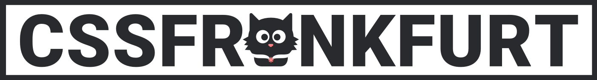
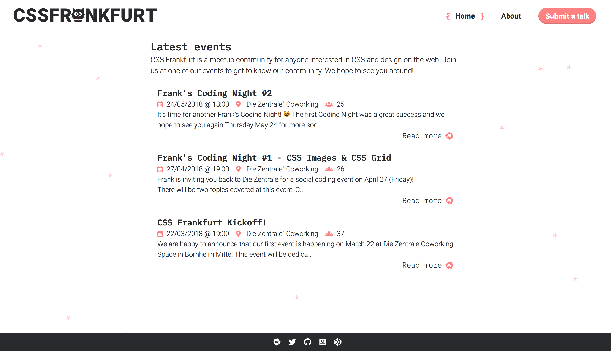

<p align="center">
  
  [](https://www.meetup.com/cssfrankfurt/members/) [](https://github.com/cssfrankfurt/cssfrankfurt.de/graphs/contributors)
</p>

# About

CSS Frankfurt is a meetup community dedidcated to CSS. We organise talks, workshops and social coding events for our members.



## Stay In Touch

- [Website](https://cssfrankfurt.de)
- [Twitter](https://twitter.com/cssfrankfurt)
- [Meetup](https://meetup.com/cssfrankfurt)

# Project setup

```
npm install
```

### Compiles and hot-reloads for development
```
npm run serve
```

### Compiles and minifies for production
```
npm run build
```

### Lints and fixes files
```
npm run lint
```


# Contributing

Any contribution is welcome and highly appreciated. Head over to our [contribution guidelines](docs/CONTRIBUTING.md) to get started!

# License

This project is licensed under the [MIT License](LICENSE.md).
