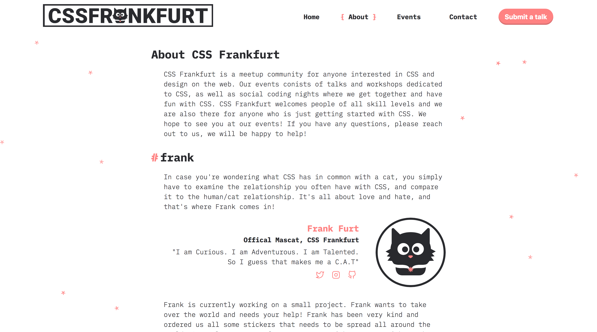

  
    

# About

CSS Frankfurt is a meetup community dedidcated to CSS that organises talks, workshops and social coding events for members.

# Build

This project is built with [vuejs](https://vuejs.org) and uses [single-file-components](https://vuejs.org/v2/guide/single-file-components.html).
 The following instructions will help you set up the project locally.

Fork the repo and download the project. Then run
* npm install - to install all neccessary dependencies
* npm run dev - to serve the app with hot reaload at localhost:8080 and lint-on-save
* npm run buil - to build for production with minification

# Contributing

Any contribution is welcome and highly appreciated. Head over to our [contribution guidelines](docs/CONTRIBUTING.md) to get started!

# Authors

* **Victoria Bergquist** - *Design & Development* - [vicbergquist](https://github.com/vicbergquist)

See a list of [contributors](https://github.com/cssfrankfurt/cssfrankfurt.de/graphs/contributors) to this project.

# License

This project is licensed under the MIT License - see the [LICENSE.md](LICENSE.md) file for details
